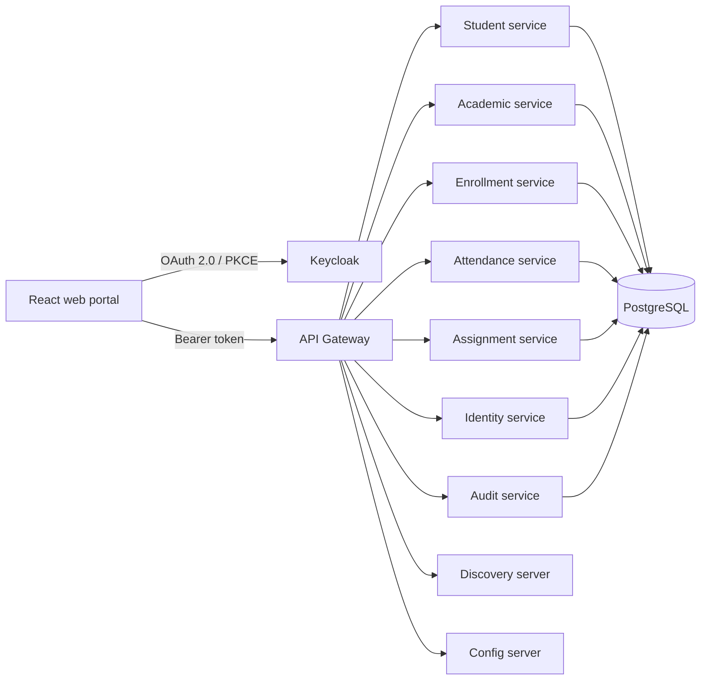

# University Management System

A full-stack university operations platform built with Spring Boot microservices and a React web portal. It supports the daily workflows of administrators, teachers, and students while demonstrating domain-driven design, hexagonal architecture, OAuth 2.0 security, and independently owned service data.

## What it does

- **Administrators** provision student and teacher accounts, manage the academic catalog, create or cancel enrollments, and view real-time system audit logs.
- **Teachers** view their assigned sections, record attendance, publish assignments, and grade submissions.
- **Students** view their profile and enrollments, track attendance, submit assignments, and see released grades.

## Architecture



The gateway is the browser and API client entry point. Keycloak authenticates users and issues tokens; each business service owns its own logical PostgreSQL database and communicates with other services through APIs rather than cross-database foreign keys.

## Repository guide

### Platform services

- `config-server` — centralized service configuration
- `discovery-server` — Eureka service discovery
- `api-gateway` — routing, CORS, JWT validation, and role enforcement
- `security-common` — shared JWT, realm-role, audience, and internal-client security
- `identity-service` — Keycloak account provisioning and domain-profile linking

### Business services

- `student-service` — student profiles and statuses
- `academic-service` — departments, programs, teachers, subjects, semesters, and sections
- `enrollment-service` — enrollments and enrolled sections
- `attendance-service` — attendance sessions, records, and percentages
- `assignment-service` — assignments, submissions, grading, and grade release
- `audit-service` — Kafka consumer and REST API for system-wide audit event records

### Frontend and documentation

- [`frontend/`](frontend/README.md) — React portal and frontend-specific setup
- [`docs/`](docs/README.md) — architecture, domain model, local-development, and API documentation

## Technology

Java 21, Spring Boot, Spring Cloud Config, Eureka, Spring Cloud Gateway, OpenFeign, Spring Security, OAuth 2.0 Resource Server, Keycloak, PostgreSQL, Flyway, Maven, Docker Compose, React, TypeScript, Vite, TanStack Query, React Hook Form, Zod, Vitest, and JUnit.

## Run locally

### Prerequisites

- Java 21
- Docker and Docker Compose
- Node.js 20 or later and npm

### 1. Start infrastructure

Copy the safe local template and adjust values only if your environment requires it:

```sh
cp .env.example .env
docker compose --env-file .env -f compose.dev.yml up -d
```

To run the Kafka audit foundation, add the messaging profile:

```sh
docker compose --env-file .env -f compose.dev.yml --profile messaging up -d
```

When starting audit-producing services (`assignment-service`, `attendance-service`, `enrollment-service`, `identity-service`), you must set environment variables. 
On Mac/Linux:
```sh
AUDIT_OUTBOX_ENABLED=true SPRING_KAFKA_BOOTSTRAP_SERVERS=localhost:9092 ./mvnw -pl enrollment-service spring-boot:run -Dspring-boot.run.profiles=dev
```
On Windows (PowerShell):
```powershell
$env:AUDIT_OUTBOX_ENABLED="true"
$env:SPRING_KAFKA_BOOTSTRAP_SERVERS="localhost:9092"
./mvnw.cmd -pl enrollment-service spring-boot:run -Dspring-boot.run.profiles=dev
```

For local metrics, traces, and logs, enable the observability profile too. Grafana is available at `http://localhost:3001`, Prometheus at `http://localhost:9090`, Tempo receives OTLP/HTTP traces on `http://localhost:4318`, and Loki listens on `http://localhost:3100`.

```sh
docker compose --env-file .env -f compose.dev.yml --profile observability up -d
```

On PowerShell, use `Copy-Item .env.example .env` instead of `cp`. The Compose file and imported Keycloak realm are explicitly for local development.

### 2. Start the backend

Start services in this order from separate terminals:

```sh
./mvnw -pl config-server spring-boot:run
./mvnw -pl discovery-server spring-boot:run -Dspring-boot.run.profiles=dev
./mvnw -pl api-gateway spring-boot:run -Dspring-boot.run.profiles=dev
```

Then start each business service you need in a separate terminal with the `dev` profile:

```sh
./mvnw -pl student-service spring-boot:run -Dspring-boot.run.profiles=dev
./mvnw -pl academic-service spring-boot:run -Dspring-boot.run.profiles=dev
./mvnw -pl enrollment-service spring-boot:run -Dspring-boot.run.profiles=dev
./mvnw -pl attendance-service spring-boot:run -Dspring-boot.run.profiles=dev
./mvnw -pl assignment-service spring-boot:run -Dspring-boot.run.profiles=dev
./mvnw -pl identity-service spring-boot:run -Dspring-boot.run.profiles=dev
```

If you are running the Kafka messaging profile, also start the audit service:

```sh
./mvnw -pl audit-service spring-boot:run -Dspring-boot.run.profiles=dev
```

On Windows, replace `./mvnw` with `./mvnw.cmd`.

### 3. Start the frontend

```sh
cd frontend
cp .env.example .env.local
npm install
npm run dev
```

*(On Windows PowerShell, use `Copy-Item .env.example .env.local` instead of `cp`)*

Open `http://localhost:5173`. The local API gateway runs at `http://localhost:8080`, and Keycloak runs at `http://localhost:8180`.

### 4. Optional demo data

After every backend service is healthy, create or reuse a complete example workflow:

```sh
node scripts/seed-demo.mjs
```

The fresh environment is otherwise empty except for the local `ums.admin` identity. See the [API walkthrough](docs/api-walkthrough.md) to create the same data manually.

## Documentation and verification

See [architecture.md](docs/architecture.md) for domain model and messaging, [api.md](docs/api.md) for the API walkthrough, and [environments.md](docs/environments.md) for URL mappings, test credentials, and troubleshooting.

Run backend tests with:

```sh
./mvnw test
```

Run [frontend](frontend/README.md) checks from `frontend/`:

```sh
npm run lint
npm test
npm run build
```
