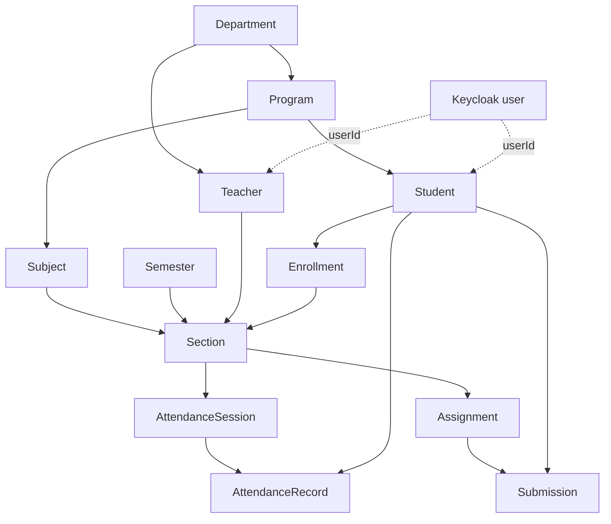

# Architecture & Domain Model

## System shape

The system is a Spring Boot microservices backend with a React browser application. The browser authenticates with Keycloak using Authorization Code with PKCE and sends bearer tokens to the API Gateway. The gateway applies CORS and role rules, then forwards requests to business services through Eureka discovery.

Configuration is served centrally by `config-server`. PostgreSQL runs as one local container with a separate logical database per business service; services do not use database-level foreign keys across those boundaries.

## Service responsibilities

| Area | Services | Responsibility |
| --- | --- | --- |
| Platform | `config-server`, `discovery-server`, `api-gateway` | Configuration, discovery, routing, and edge security |
| Identity | `identity-service`, `security-common` | Keycloak provisioning, profile linking, JWT audience and realm-role handling |
| Academic records | `student-service`, `academic-service`, `enrollment-service` | People, catalog, sections, and enrollment lifecycle |
| Teaching workflows | `attendance-service`, `assignment-service` | Attendance, assignments, submissions, grades, and release workflow |
| Browser application | `frontend` | Role-aware administrator, teacher, and student experience |

## Domain and integration rules

Business services follow a domain, application, and infrastructure separation. Cross-service relationships are stored as IDs and resolved through service APIs. Internal endpoints are reserved for service-to-service calls and are not exposed in public API documentation or through the gateway.

`/internal/academic` is the Academic Service's read-only service contract. Student, enrollment, attendance, and assignment services use it to validate programs, enrollment eligibility, section ownership, and assignments without accessing the Academic Service database. Browser clients use only gateway-routed public APIs; `/teachers/me` and `/students/me` resolve the caller's profile from the JWT subject.

Keycloak owns credentials, sessions, roles, and token issuance. Business services own university-domain profiles and records. A student or teacher profile is linked to a Keycloak subject, and browser clients do not submit profile identifiers to establish their own identity.

Identity provisioning generates immutable student/teacher codes, usernames, and university email addresses in the identity service. Administrators provide a personal contact email for the Keycloak verification/password-setup invitation; they never provide or see an initial password. Academic catalog and enrollment records use deactivation/cancellation rather than hard deletion to retain historical integrity.

## Data ownership

Each business service owns its database and schema. Relationships that cross service boundaries are stored as identifiers and validated through service APIs; services do not create foreign keys into another service's database.

| Owner | Domain data |
| --- | --- |
| Keycloak | Users, credentials, roles, login sessions, and tokens |
| Student service | Student profiles and lifecycle status |
| Academic service | Departments, programs, teachers, semesters, subjects, prerequisites, sections, and schedules |
| Enrollment service | Enrollments and enrolled sections |
| Attendance service | Attendance sessions and records |
| Assignment service | Assignments and submissions |
| Identity service | Idempotent account/profile provisioning records |

Flyway migrations are the source of truth for physical tables and columns. This document describes domain relationships rather than duplicating schema definitions that can become stale.

## Main relationships

## Implemented lifecycle rules

- Student and teacher profiles are linked to a unique Keycloak user.
- Administrators provision accounts through the identity service; the account is enabled only after its domain profile is created.
- Academic records use active/inactive lifecycle operations instead of public physical-delete endpoints.
- Enrollment requires an active student, semester, and section and rejects duplicate active enrollment.
- Attendance records belong to a session and an enrolled student; recording the same student again updates the existing record.
- Assignments move from draft to published and may then be closed.
- Submissions require active enrollment, are marked on-time or late, and hide grades until release.
- Teacher and student self-service endpoints resolve identity from the JWT subject instead of trusting caller-supplied profile identifiers.

## Audit and Messaging

The University Management System uses an event-driven architecture powered by Kafka for asynchronous audit logging. This decouples the core business logic from the audit storage, ensuring that high-throughput operations aren't slowed down by synchronous audit writes.

### Components

**`audit-common`**: A shared library module (JAR) that provides:
- The domain models and event schemas for audit records.
- Annotations and AOP aspects for declarative audit logging.
- An implementation of the **Transactional Outbox** pattern. This ensures that business data changes and the corresponding audit events are committed in the same database transaction. A background job then reliably relays these events from the outbox table to Kafka.

**`audit-service`**: A standalone microservice.
- Acts as a Kafka consumer, listening to configured audit topics (`ums.audit.v1`).
- Consumes events and persists them into its own PostgreSQL database table (`audit_records`).
- Exposes a secured, role-based REST API (`/api/audits`) to query audit events with pagination and filtering.
- Powers the real-time **Audit Logs** dashboard in the React web portal for Administrators.

## Infrastructure

The development Compose file starts several infrastructure containers essential to the platform's operation:

- **PostgreSQL**: Initialization scripts create the logical databases used by student, academic, enrollment, attendance, assignment, identity, and Keycloak data. 
- **Keycloak**: Imports the local `ums` realm from `docker/keycloak/dev-import/ums-realm.json`.
- **Redis**: Provides caching for the API Gateway's token bucket rate-limiting algorithms.
- **Mailhog**: Serves as a local SMTP testing server that intercepts all outbound emails (such as Keycloak's password reset and verification emails) so they can be viewed locally via its web UI.
- **Kafka**: When running with the `messaging` profile, Kafka handles asynchronous audit events published by the transactional outbox.

See [environments](environments.md) for startup and reset instructions, credential mappings, and URL routing details.
