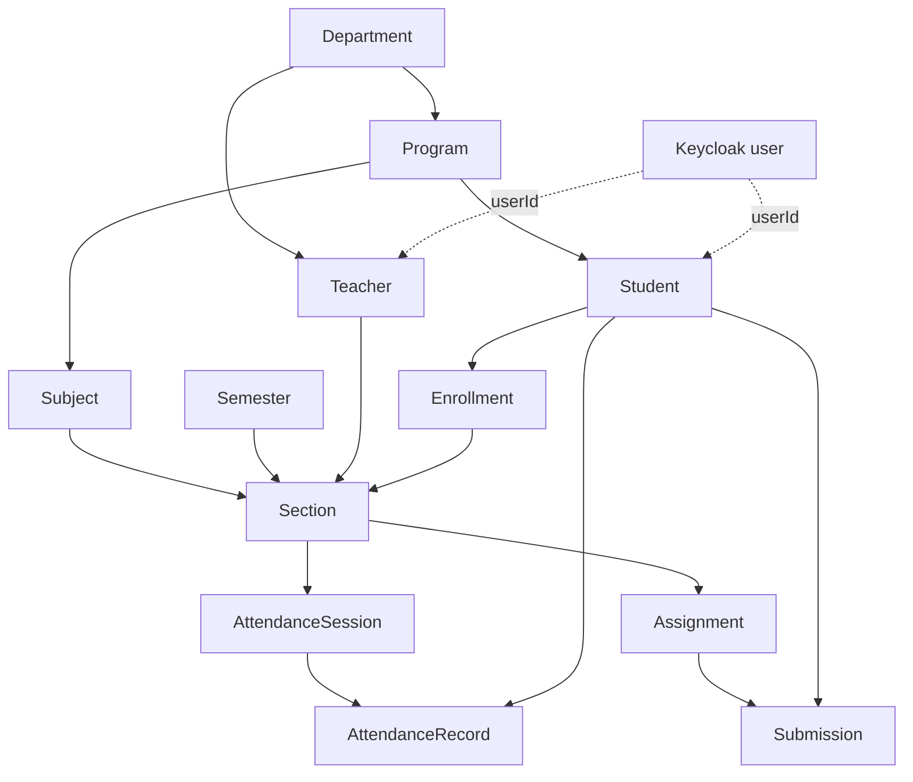

# Domain model

## Data ownership

Each business service owns its database and schema. Relationships that cross service boundaries are stored as identifiers and validated through service APIs; services do not create foreign keys into another service's database.

| Owner | Domain data |
| --- | --- |
| Keycloak | Users, credentials, roles, login sessions, and tokens |
| Student service | Student profiles and lifecycle status |
| Academic service | Departments, programs, teachers, semesters, subjects, prerequisites, sections, and schedules |
| Enrollment service | Enrollments and enrolled sections |
| Attendance service | Attendance sessions and records |
| Assignment service | Assignments and submissions |
| Identity service | Idempotent account/profile provisioning records |

Flyway migrations are the source of truth for physical tables and columns. This document describes domain relationships rather than duplicating schema definitions that can become stale.

## Main relationships

## Implemented lifecycle rules

- Student and teacher profiles are linked to a unique Keycloak user.
- Administrators provision accounts through the identity service; the account is enabled only after its domain profile is created.
- Academic records use active/inactive lifecycle operations instead of public physical-delete endpoints.
- Enrollment requires an active student, semester, and section and rejects duplicate active enrollment.
- Attendance records belong to a session and an enrolled student; recording the same student again updates the existing record.
- Assignments move from draft to published and may then be closed.
- Submissions require active enrollment, are marked on-time or late, and hide grades until release.
- Teacher and student self-service endpoints resolve identity from the JWT subject instead of trusting caller-supplied profile identifiers.

See the [architecture guide](architecture.md) for service interactions and the [API walkthrough](api-walkthrough.md) for a complete example.
